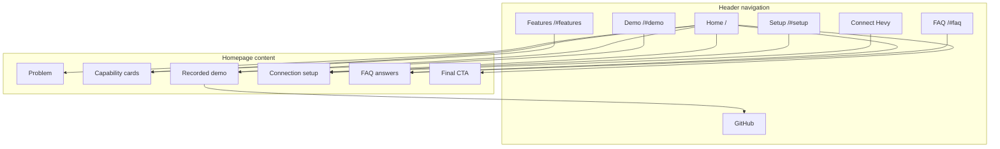

# Hevy MCP Site Architecture Plan

**Review date:** 2026-07-20
**Site type:** Open-source product marketing site with setup/documentation content
**Current state:** Existing single-page site; recommended expansion into a shallow marketing site plus documentation hub

## Review basis

This plan is based on:

- `README.md`
- Astro routes under `src/pages/`
- Header, footer, homepage, setup, FAQ, and data components
- The generated static build
- Desktop and mobile review of the local site
- `npm run check` and `npm run build`

No product-marketing context file was present. The audience and business goals below are inferred from the current copy and setup modes.

## Executive summary

The current site is a strong single-page launch experience. Its primary path is clear:

1. Understand the problem.
2. See an evidence-based demo.
3. Choose a connection method.
4. Verify the connection.

The current flat structure is appropriate for an early launch. The main architectural risk is that marketing content and technical setup documentation are bundled into one long page. Browser OAuth, direct HTTPS, local stdio, and client-specific instructions now represent distinct user intents that should eventually have stable URLs.

### Priority recommendations

1. Fix fragment links in the 404 page.
2. Create a `/docs/getting-started` hub.
3. Give each connection method a stable URL.
4. Add client-specific setup guides.
5. Move key-handling and OAuth information into a focused `/security` page.
6. Add breadcrumbs, a documentation sidebar, a sitemap, and a confirmed canonical host as the site expands.

## Audience and goals

### Primary audiences

- **Hevy PRO users** who want to ask an AI assistant about their training data.
- **Remote HTTP developers** using Codex, Claude, Cursor, or another MCP client that supports a fixed bearer credential.
- **Local-control developers** using stdio because their client does not support remote HTTP or because they prefer to run the process locally.

### Primary site goals

1. Convert visitors into connected Hevy MCP users.
2. Help users complete setup without abandoning the flow.
3. Establish trust around API-key handling, OAuth, open-source status, and mutation confirmation.
4. [INFERENCE] Capture high-intent search traffic for Hevy MCP connection and client setup queries.

## Current page hierarchy

```text
Homepage (/)
├── Features (/#features)
│   ├── Understand your progress
│   ├── Find routines and exercises faster
│   └── Plan and log training
├── Demo (/#demo)
│   └── Recorded video (/demo/hevy-mcp-demo.mp4)
├── Setup (/#setup)
│   ├── Browser sign-in [tab]
│   │   ├── Claude.ai
│   │   └── Other OAuth clients
│   ├── Direct HTTPS [tab]
│   │   ├── Codex
│   │   └── Other HTTP clients
│   └── Run locally [tab]
│       ├── Codex
│       ├── Claude / Cursor
│       └── Any stdio client
├── FAQ (/#faq)
├── GitHub (external)
├── npm (footer, external)
├── Issues (footer, external)
└── 404 (/404.html)
```

The current build contains two HTML pages: `/index.html` and `/404.html`. The demo video is a static asset rather than an HTML page.

## Current visual sitemap



## Recommended target hierarchy

Keep the homepage as the primary conversion page. Move high-intent setup content into indexable routes.

```text
Homepage (/)
├── Features (/features)
│   ├── Training analysis (/features/training-analysis)
│   ├── Search routines and exercises (/features/search)
│   └── Manage workouts and measurements (/features/manage-training)
├── Get started (/docs/getting-started)
│   ├── Browser sign-in (/docs/connect/browser)
│   ├── Direct HTTPS (/docs/connect/https)
│   ├── Local stdio (/docs/connect/local)
│   └── Client guides (/docs/clients)
│       ├── Claude.ai (/docs/clients/claude-ai)
│       ├── Codex (/docs/clients/codex)
│       ├── Claude Desktop (/docs/clients/claude-desktop)
│       └── Cursor (/docs/clients/cursor)
├── Security (/security)
├── FAQ (/faq)
├── Open source (external GitHub)
└── 404 (/404.html)
```

Do not create every feature page until each page has materially unique content. The setup and client pages are the higher-priority expansion because they correspond to explicit user intent.

## URL map

| Page | Current URL | Recommended URL | Parent | Navigation | Priority |
|---|---|---|---|---|---|
| Homepage | `/` | `/` | — | Header logo | High |
| Features | `/#features` | `/features` or keep the section initially | Homepage | Header | High |
| Demo | `/#demo` | `/#demo` | Homepage | Header | Medium |
| Recorded demo | `/demo/hevy-mcp-demo.mp4` | Same | Demo | Demo CTA | Medium |
| Setup | `/#setup` | `/docs/getting-started` | Homepage | Header CTA | High |
| Browser sign-in | Setup tab | `/docs/connect/browser` | Getting started | Setup hub | High |
| Direct HTTPS | Setup tab | `/docs/connect/https` | Getting started | Setup hub | High |
| Local stdio | Setup tab | `/docs/connect/local` | Getting started | Setup hub | High |
| Client guides | Setup tabs | `/docs/clients/{client}` | Getting started | Documentation sidebar | High |
| Security | FAQ content | `/security` | Homepage | Footer and FAQ | Medium |
| FAQ | `/#faq` | `/faq` or keep the section initially | Homepage | Header/footer | Medium |
| 404 | `/404.html` | `/404.html` | — | Error fallback | Low |

Pick and enforce one trailing-slash policy before adding documentation routes. Astro is configured for directory-style static output.

## Navigation specification

### Current header

Current order:

1. Features
2. Demo
3. Setup
4. FAQ
5. GitHub utility link
6. Connect Hevy CTA

This is within the recommended 4–7 primary navigation items. The CTA is correctly placed on the right.

### Recommended header after documentation expansion

1. Features
2. Get started
3. Security
4. FAQ
5. GitHub utility link
6. Connect Hevy CTA

Keep Demo as a homepage section rather than a top-level page unless more demonstrations or case studies are added.

### Current footer

- GitHub
- npm
- Issues
- MIT license
- Independent-project disclaimer

### Recommended footer groups

```text
Product
- Features
- Get started
- Security

Resources
- Documentation
- FAQ
- GitHub
- npm

Support
- Issues
- Troubleshooting

Legal / trust
- MIT license
- Security
- Independent-project disclaimer
```

An About or Company section is unnecessary unless the project develops a separate organization or commercial offering.

### Documentation navigation

Use a persistent sidebar inside `/docs/`:

```text
Get started
├── Overview
├── Browser sign-in
├── Direct HTTPS
├── Local stdio
└── Client guides
    ├── Claude.ai
    ├── Codex
    ├── Claude Desktop
    └── Cursor
```

Add previous/next links between connection pages and a visible link back to the main setup hub.

### Breadcrumbs

Use breadcrumbs on every nested documentation page:

```text
Home > Docs > Connect > Browser sign-in
Home > Docs > Clients > Codex
```

Every segment except the current page should be clickable. Breadcrumbs should match the URL hierarchy exactly.

## Internal linking plan

### Homepage links

- Hero CTA → `/docs/getting-started`
- Feature cards → corresponding `/features/*` pages when available
- Demo → relevant feature page and setup guide
- Setup summary → all three connection-method pages
- FAQ answers → security or client documentation where appropriate
- Final CTA → `/docs/getting-started`

### Documentation hub links

`/docs/getting-started` should link to:

- All three connection methods.
- Client-specific instructions.
- Security information.
- Troubleshooting.
- The upstream GitHub quick-start source.

### Connection-page links

Every connection page should include:

- Breadcrumbs back to the documentation hierarchy.
- A link to `/docs/getting-started`.
- Links to compatible client guides.
- A link to `/security`.
- A consistent connection-verification CTA.
- Previous/next links between connection methods.

### Feature-page links

Every feature page should link to:

- `/docs/getting-started`.
- The relevant MCP tool group or GitHub source.
- A concrete example or demo.
- Related features.

### Orphan-page rules

Every future documentation and feature page must have:

1. A link from its hub page.
2. At least one contextual link from the homepage or a related page.
3. A breadcrumb path.
4. A footer or sidebar path when appropriate.

The current root sections are linked from the header. The recorded video is linked from the Demo section. GitHub, npm, Issues, and the license are linked from the footer.

## Prioritized findings

### High: fix 404 fragment navigation

`SiteHeader.astro` uses fragment-only links such as `#features`, `#demo`, `#setup`, and `#faq`. These targets exist on `/` but not on the 404 page. Build and browser review confirmed that the 404 header links do not resolve to targets.

Recommended fix: use absolute homepage fragment URLs such as `/#features`, or render a 404-specific header.

### High: make setup modes deep-linkable

The setup modes are selected through JavaScript and all share `#setup`. The mode state is not represented in the URL, so users cannot share a direct link to Browser sign-in, Direct HTTPS, or Local stdio instructions.

Recommended fix: create the three connection routes and use the homepage tabs as summaries linking to those routes.

### High: create a documentation hub

Setup content is currently a large section on the homepage and points users to GitHub for the complete guide. A `/docs/getting-started` hub would provide a stable entry point and reduce cognitive load without changing the homepage conversion path.

### Medium: move security information out of the FAQ

API-key handling, OAuth storage, direct browser requests, and mutation confirmation are trust-critical content. Give them a dedicated `/security` page and link to it from setup, FAQ, and the footer.

### Medium: add documentation-oriented footer links

The current footer is repository-oriented. Add documentation, security, and troubleshooting links when those routes exist.

### Medium: confirm canonical host

The generated canonical currently uses `https://hevy-mcp.workers.dev/`. If the intended public host is a custom domain, update the Astro site configuration before adding more routes.

### Low: add sitemap support when routes expand

The current two-page build does not require an elaborate sitemap. Add `sitemap.xml` and reference it from `robots.txt` once documentation and feature routes are introduced.

## Implementation sequence

1. Fix 404 navigation links.
2. Add `/docs/getting-started` with the current setup overview.
3. Add Browser sign-in, Direct HTTPS, and Local stdio pages.
4. Add client pages for Codex, Claude.ai, Claude Desktop, and Cursor.
5. Add `/security` and link it from setup and FAQ.
6. Add documentation sidebar, breadcrumbs, previous/next links, and contextual CTAs.
7. Confirm canonical host, trailing-slash policy, sitemap, and robots configuration.
8. Split feature sections into dedicated pages only when unique content exists.

## Verification baseline

At review time:

- `npm run check` completed with 0 errors, 0 warnings, and 0 hints.
- `npm run build` completed successfully.
- Desktop and mobile homepage layouts were reviewed locally.
- Mobile navigation expanded with the expected ARIA state.
- Setup transport switching from Browser sign-in to Run locally worked.
- Root fragment links resolved to existing targets.
- 404 fragment links remained the known navigation defect described above.
